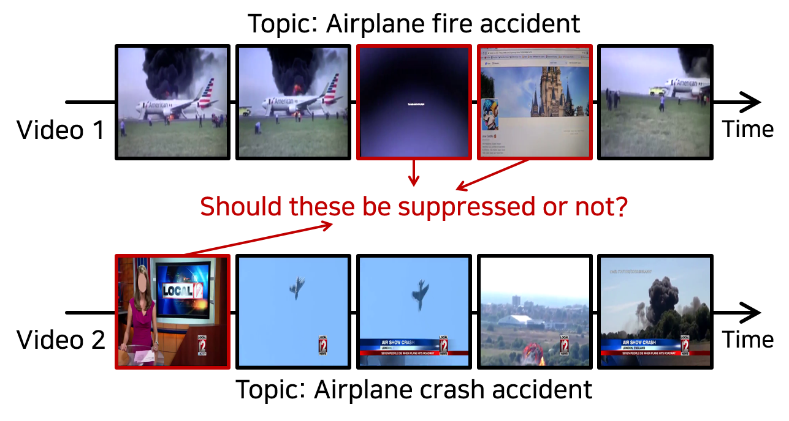
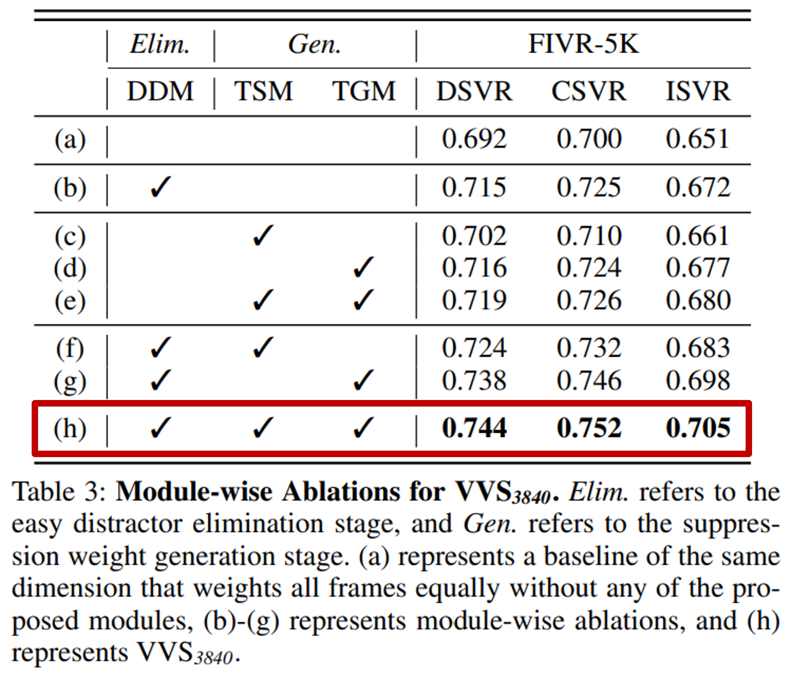

# [AAAI-24] VVS : Video-to-Video Retrieval With Irrelevant Frame Suppression

### Official Pytorch Implementation of [VVS: Video-to-Video Retrieval With Irrelevant Frame Suppression](https://arxiv.org/abs/2303.08906) 

<p align="center"></p>

> **Paper**: [Video-to-Video Retrieval With Irrelevant Frame Suppression](https://arxiv.org/abs/2303.08906) 

---

# ⏩ For a fast evaluation

* For a fast verification, a simple evaluation protocol is guided as follows.

<p align="center"></p>

- The process of fast evaluation for **VVS on FIVR5K** can be summarized into 3 steps:

  1. Download the data from an [Google Drive link](https://drive.google.com/file/d/10H8VKXVFDc_y6JJRq3smoe62uHMkBbnI/view?usp=drive_link).

  2. Please locate the data as below
     * Place the ```pca.pkl``` inside a ```VVS/data/vcdb``` folder
     * Place the ```fivr5k_resnet50_l4imac``` inside a ```VVS/features``` folder
     * Place the ```table_benchmark_dim_3840``` inside a ```VVS/jobs``` folder

  3. Run the command to evaluate the **VVS on FIVR5K**
     * ```bash experiments/review/fast_evaluation_fivr5k.sh```


# 🎞 Data Preparation
## Getting the Dataset
* Download the raw video dataset you want. The supported options are:
    * [CC_WEB_VIDEO](http://vireo.cs.cityu.edu.hk/webvideo/)
    * [VCDB](https://fvl.fudan.edu.cn/dataset/vcdb/list.htm)
    * [FIVR](http://ndd.iti.gr/fivr/)  
    * [EVVE](https://ieeexplore.ieee.org/stamp/stamp.jsp?tp=&arnumber=6619162)  


* You should contact the author about the missing video that occurs during the download process.
* The raw video data should be located like the structure below. 

* **But preparing raw video is not essential. We provide the features, we used.**

~~~~
├── videos
   ├── fivr
      └── videos
         ├── video_1
         ├── video_2
         └── ...
   ├── cc_web
      └── videos
         ├── video_1
         ├── video_2
         └── ...
   ├── evve
      └── videos
         ├── video_1
         ├── video_2
         └── ...
~~~~
    
    
    
## ➡️ Getting the Feature
* For convenience, we provide the features we used. You can find them here.
   * [CC_WEB_VIDEO](https://drive.google.com/file/d/1eNgG0uNGJ4ODCbxxdcBtYjgAMdETmHCy/view?usp=drive_link) 
   * [VCDB](https://drive.google.com/file/d/1RX9I5eGMUpjfN4d-dZaS1SHiGCINbm5k/view?usp=drive_link) 
   * [FIVR](https://drive.google.com/file/d/1zwU6cDIb2B02znxvQs8xI1Zscpg3i0Ws/view?usp=drive_link) 
   * [EVVE](https://drive.google.com/file/d/19Uq5dlY0WhBQYTfzEnlJCVDUhTrVk_SG/view?usp=drive_link) 
   
* Before running, Place the features inside a ```VVS/features``` folder.
~~~~
├── features
   └── vcdb_resnet50_l4imac
      ├── features
         ├── feat_1
         ├── feat_2
         └── ...
   └── fivr_resnet50_l4imac
      ├── features
         ├── feat_1
         ├── feat_2
         └── ...
   └── cc_web_resnet50_l4imac
      ├── features
         ├── feat_1
         ├── feat_2
         └── ...
    └── evve_resnet50_l4imac
      ├── features
         ├── feat_1
         ├── feat_2
         └── ...
~~~~

# 🔨 Prerequisites

### Recommended Environment
* OS : Ubuntu 18.04
* CUDA : 10.2
* Python 3.7
* Pytorch 1.8.1 Torchvision 0.9.1
* GPU : NVIDA-Tesla V100(32G)

Required packages are listed in **environment.yaml**. You can install by running:

```
conda env create -f environment.yaml
conda activate VVS
```

If your GPU only support above CUDA 11.0, you can install by running:
```
conda env create -f environment_cuda11.yaml
conda activate VVS
```

# 🔄 Running

* Before running, Place the [pca.pkl](https://drive.google.com/file/d/16Ec6BfdOgwzF3cJcOyQdI6dPZAeyZFVh/view?usp=drive_link) inside a ```VVS/data/vcdb``` folder or you can calculate PCA weight directly ```python cal_pca.py```.
* You can easily evaluate the model by running the provided script.


> Please follow the instructions in [README.md](experiments/README.md) for training and evaluation


# 🔑 Models
We provide [checkpoints](https://drive.google.com/file/d/1TXRR5JH0jS-zTapLFDVkB9vvrEpPVWuL/view?usp=drive_link), to succesfully reproduce our benchmark experiments.

* You can run the script according to the **feature dimension**.

| Dataset  | script | 
| :----- | :---- | 
| FIVR5K  | ```$ bash experiments/main_script/train/table_benchmark/eval_benchmark_fivr5k_dim_{dim}.sh``` | 
| FIVR200K  | ```$ bash experiments/main_script/train/table_benchmark/eval_benchmark_fivr200k_dim_{dim}.sh``` | 
| CC_WEB_VIDEO  | ```$ bash experiments/main_script/train/table_benchmark/eval_benchmark_cc_web_dim_{dim}.sh``` | 


# 📑 Experiments
## FIVR200K

<table>
<thead>
  <tr>
    <th>Usage</th>
    <th>Method</th>
    <th>train dataset</th>
    <th>DSVR</th>
    <th>CSVR</th>
    <th>ISVR</th>
  </tr>
</thead>
<tbody>
  <tr>
    <td rowspan="10">frame</td>
    <td>TN</td>
    <td>VCDB</td>
    <td>0.724</td>
    <td>0.699</td>
    <td>0.589</td>
  </tr>
  <tr>
    <td>DP</td>
    <td>VCDB</td>
    <td>0.775</td>
    <td>0.740</td>
    <td>0.632</td>
  </tr>
  <tr>
    <td>TCA<sub>sym</sub></td>
    <td>VCDB</td>
    <td>0.728</td>
    <td>0.698</td>
    <td>0.592</td>
  </tr>
  <tr>
    <td>TCA<sub>f</sub></td>
    <td>VCDB</td>
    <td>0.877</td>
    <td>0.830</td>
    <td><b>0.703</b></td>
  </tr>
  <tr>
    <td>SCFV+NIP<sub>256</sub></td>
    <td>VCDB</td>
    <td>0.819</td>
    <td>0.764</td>
    <td>0.622</td>
  </tr>
  <tr>
    <td>SCFV+TNIP<sub>256</sub></td>
    <td>VCDB</td>
    <td><b>0.896</b></td>
    <td>0.833</td>
    <td>0.674</td>
  </tr>
  <tr>
    <td>ViSiL<sub>sym</sub></td>
    <td>VCDB</td>
    <td>0.833</td>
    <td>0.792</td>
    <td>0.654</td>
  </tr>
  <tr>
    <td>ViSiL<sub>f</sub></td>
    <td>VCDB</td>
    <td>0.843</td>
    <td>0.797</td>
    <td>0.660</td>
  </tr>
  <tr>
    <td>ViSiL<sub>v</sub></td>
    <td>VCDB</td>
    <td>0.892</td>
    <td><b>0.841</b></td>
    <td>0.702</td>
  </tr>
  <tr>
    <td>DnS(S<sup>f</sup><sub>A</sub>)</td>
    <td>DnS-100K</td>
    <td>0.921</td>
    <td>0.875</td>
    <td>0.741</td>
  </tr>
  <tr>
    <td rowspan="11">video</td>
    <td>HC</td>
    <td>VCDB</td>
    <td>0.265</td>
    <td>0.247</td>
    <td>0.193</td>
  </tr>
  <tr>
    <td>DML</td>
    <td>VCDB</td>
    <td>0.398</td>
    <td>0.378</td>
    <td>0.309</td>
  </tr>
  <tr>
    <td>TMK</td>
    <td>VCDB</td>
    <td>0.417</td>
    <td>0.394</td>
    <td>0.319</td>
  </tr>
  <tr>
    <td>LAMV</td>
    <td>VCDB</td>
    <td>0.489</td>
    <td>0.459</td>
    <td>0.364</td>
  </tr>
  <tr>
    <td>VRAG</td>
    <td>VCDB</td>
    <td>0.484</td>
    <td>0.470</td>
    <td>0.399</td>
  </tr>
  <tr>
    <td>TCA<sub>c</sub></td>
    <td>VCDB</td>
    <td>0.570</td>
    <td>0.553</td>
    <td>0.473</td>
  </tr>
  <tr>
    <td>DnS(S<sup>c</sup>)</td>
    <td>DnS-100K</td>
    <td>0.574</td>
    <td>0.558</td>
    <td>0.476</td>
  </tr>
  <tr>
    <td><b>VVS<sub>500</sub>(Ours)</b></td>
    <td>VCDB</td>
    <td><b>0.606</b></td>
    <td><b>0.588</b></td>
    <td><b>0.502</b></td>
  </tr>
  <tr>
    <td><b>VVS<sub>512</sub>(Ours)</b></td>
    <td>VCDB</td>
    <td><b>0.608</b></td>
    <td><b>0.590</b></td>
    <td><b>0.505</b></td>
  </tr>
  <tr>
    <td><b>VVS<sub>1024</sub>(Ours)</b></td>
    <td>VCDB</td>
    <td><b>0.645</b></td>
    <td><b>0.627</b></td>
    <td><b>0.536</b></td>
  </tr>
  <tr>
    <td><b>VVS<sub>3840</sub>(Ours)<b></td>
    <td>VCDB</td>
    <td><b>0.711</b></td>
    <td><b>0.689</b></td>
    <td><b>0.590</b></td>
  </tr>
</tbody>
</table>


## CC_WEB_VIDEO

<table>
<thead>
  <tr>
    <th>Usage</th>
    <th>Method</th>
    <th>train dataset</th>
    <th>cc_web</th>
    <th>cc_web<sup>*</sup></th>
    <th>cc_web<sub>c</sub></th>
    <th>cc_web<sub>c</sub><sup>*</sup></th>
  </tr>
</thead>
<tbody>
  <tr>
    <td rowspan="11">frame</td>
    <td>TN</td>
    <td>VCDB</td>
    <td>0.978</td>
    <td>0.965</td>
    <td>0.991</td>
    <td>0.987</td>
  </tr>
  <tr>
    <td>DP</td>
    <td>VCDB</td>
    <td>0.975</td>
    <td>0.958</td>
    <td>0.990</td>
    <td>0.982</td>
  </tr>
  <tr>
    <td>CTE</td>
    <td>VCDB</td>
    <td>0.996</td>
    <td>-</td>
    <td>-</td>
    <td>-</td>
  </tr>
  <tr>
    <td>TCA<sub>sym</sub></td>
    <td>VCDB</td>
    <td>0.982</td>
    <td>0.962</td>
    <td>0.992</td>
    <td>0.981</td>
  </tr>
  <tr>
    <td>TCA<sub>f</sub></td>
    <td>VCDB</td>
    <td>0.983</td>
    <td>0.969</td>
    <td>0.994</td>
    <td>0.990</td>
  </tr>
  <tr>
    <td>SCFV+NIP<sub>256</sub></td>
    <td>VCDB</td>
    <td>0.973</td>
    <td>0.953</td>
    <td>0.976</td>
    <td>0.959</td>
  </tr>
  <tr>
    <td>SCFV+TNIP<sub>256</sub></td>
    <td>VCDB</td>
    <td>0.978</td>
    <td>0.969</td>
    <td>0.983</td>
    <td>0.975</td>
  </tr>
  <tr>
    <td>ViSiL<sub>sym</sub></td>
    <td>VCDB</td>
    <td>0.982</td>
    <td>0.969</td>
    <td>0.991</td>
    <td>0.988</td>
  </tr>
  <tr>
    <td>ViSiL<sub>f</sub></td>
    <td>VCDB</td>
    <td>0.984</td>
    <td>0.969</td>
    <td>0.993</td>
    <td>0.987</td>
  </tr>
  <tr>
    <td>ViSiL<sub>v</sub></td>
    <td>VCDB</td>
    <td>0.985</td>
    <td><b>0.971</b></td>
    <td><b>0.996</b></td>
    <td><b>0.993</b></td>
  </tr>
  <tr>
    <td>DnS(S<sup>f</sup><sub>A</sub>)</td>
    <td>DnS-100K</td>
    <td>0.984</td>
    <td>0.973</td>
    <td>0.995</td>
    <td>0.992</td>
  </tr>
  <tr>
    <td rowspan="9">video</td>
    <td>HC</td>
    <td>VCDB</td>
    <td>0.958</td>
    <td>-</td>
    <td>-</td>
    <td>-</td>
  </tr>
  <tr>
    <td>DML</td>
    <td>VCDB</td>
    <td>0.971</td>
    <td>0.941</td>
    <td>0.979</td>
    <td>0.959</td>
  </tr>
  <tr>
    <td>VRAG</td>
    <td>VCDB</td>
    <td>0.971</td>
    <td>0.952</td>
    <td>0.980</td>
    <td>0.967</td>
  </tr>
  <tr>
    <td>TCA<sub>c</sub></td>
    <td>VCDB</td>
    <td>0.973</td>
    <td>0.947</td>
    <td>0.983</td>
    <td>0.965</td>
  </tr>
  <tr>
    <td>DnS(S<sup>c</sup>)</td>
    <td>DnS-100K</td>
    <td>0.972</td>
    <td>0.952</td>
    <td>0.980</td>
    <td>0.967</td>
  </tr>
  <tr>
    <td><b>VVS<sub>500</sub>(Ours)</b></td>
    <td>VCDB</td>
    <td><b>0.973</b></td>
    <td><b>0.952</b></td>
    <td><b>0.981</b></td>
    <td><b>0.966</b></td>
  </tr>
  <tr>
    <td><b>VVS<sub>512</sub>(Ours)</b></td>
    <td>VCDB</td>
    <td><b>0.973</b></td>
    <td><b>0.952</b></td>
    <td><b>0.981</b></td>
    <td><b>0.967</b></td>
  </tr>
  <tr>
    <td><b>VVS<sub>1024</sub>(Ours)</b></td>
    <td>VCDB</td>
    <td><b>0.973</b></td>
    <td><b>0.952</b></td>
    <td><b>0.982</b></td>
    <td><b>0.969</b></td>
  </tr>
  <tr>
    <td><b>VVS<sub>3840</sub>(Ours)<b></td>
    <td>VCDB</td>
    <td><b>0.975</b></td>
    <td><b>0.955</b></td>
    <td><b>0.984</b></td>
    <td><b>0.973</b></td>
  </tr>
</tbody>
</table>

## 👍 References
We referenced the repos below for the code.

* [ViSiL](https://github.com/MKLab-ITI/visil)
* [FIVR](https://github.com/MKLab-ITI/FIVR-200K)
* [CC_WEB](http://vireo.cs.cityu.edu.hk/webvideo/)

## ✉ Contact
If you have any question or comment, please contact using the issue.

