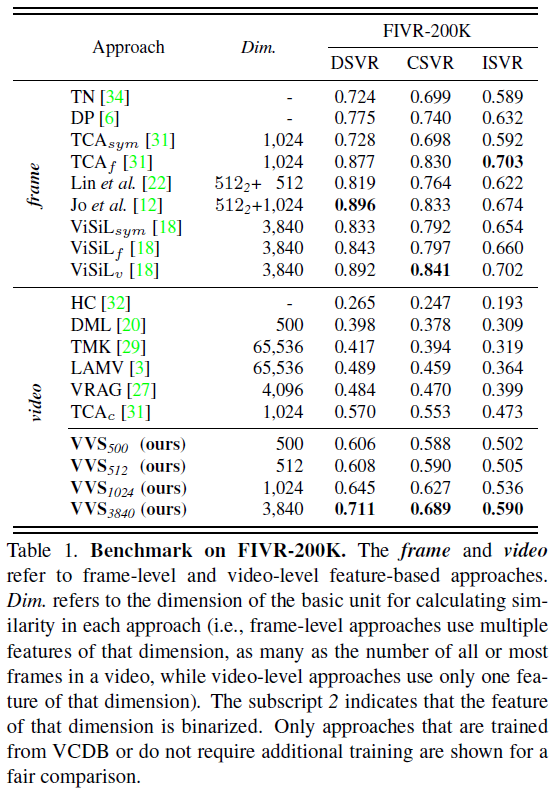
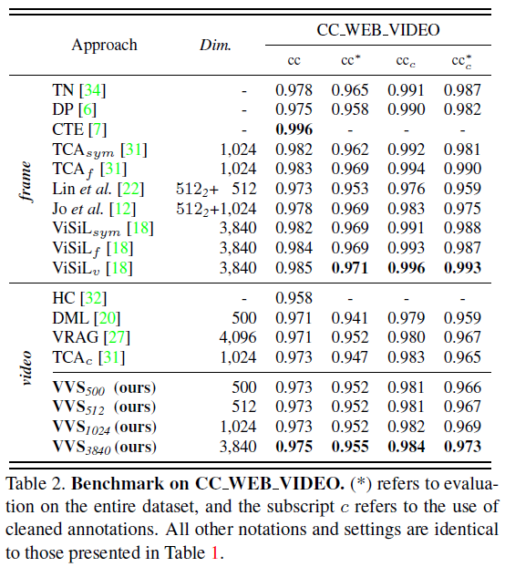

## Experiments

* You can easily reproduce the experiments by running the provided script.
* The performance of every experiment is measured at **convergence within 80,000 iterations.** 
---

#### Table1. FIVR-200K (Benchmark)
<p align="center"></p>

#### Training
```bash
# Run the command below to train the VVS.
$ bash experiments/main_script/train/table_benchmark/train_benchmark_dim_{dim}.sh
```

#### Evaluation
```bash
# Run the command below to eval the VVS.
$ bash experiments/main_script/eval/table_benchmark/eval_benchmark_fivr200k_dim_{dim}.sh
```

---


#### Table2. CC-WEB VIDEO (Benchmark)
<p align="center"></p>

#### Training
```bash
# Run the command below to train the VVS.
$ bash experiments/main_script/train/table_benchmark/train_benchmark_dim_{dim}.sh
```

#### Evaluation
```bash
# Run the command below to eval the VVS.
$ bash experiments/main_script/eval/table_benchmark/eval_benchmark_cc_web_dim_{dim}.sh
```

---
